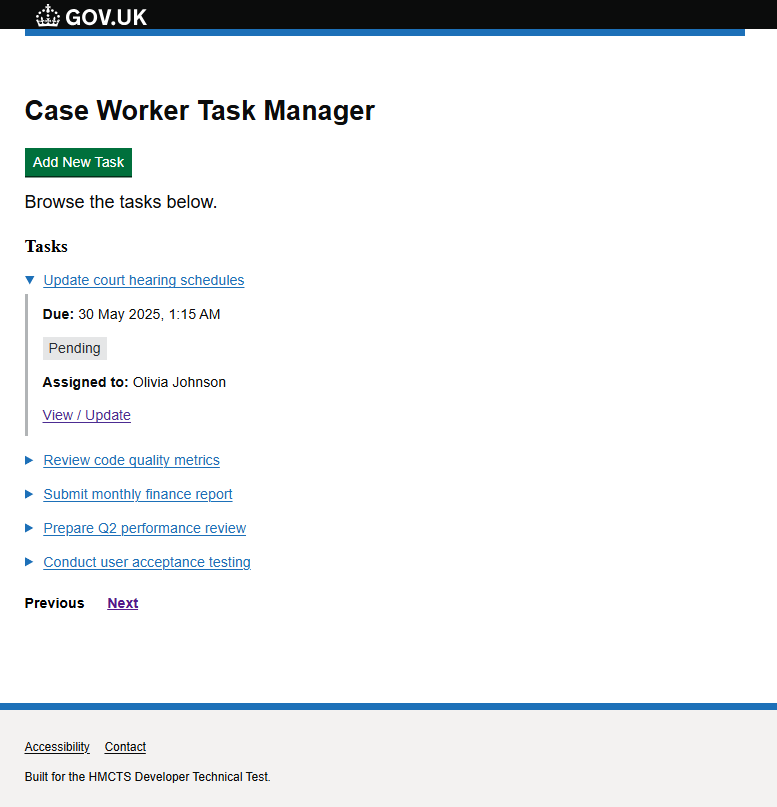
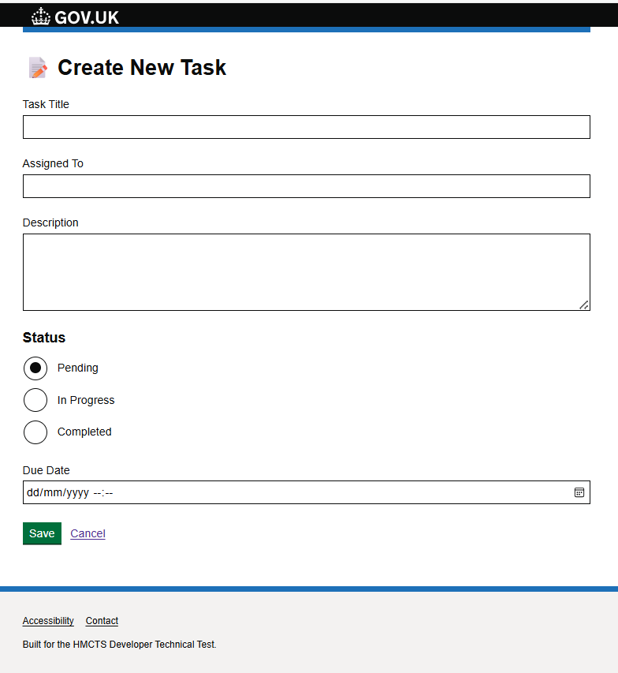
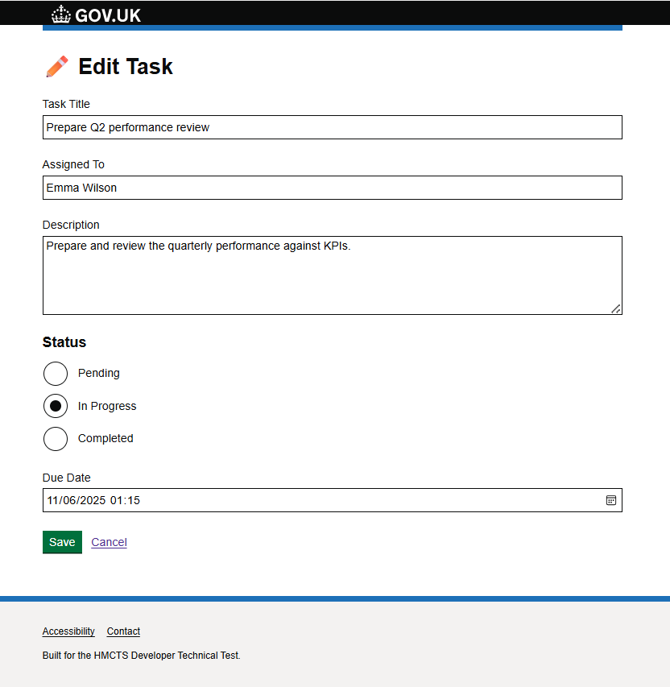
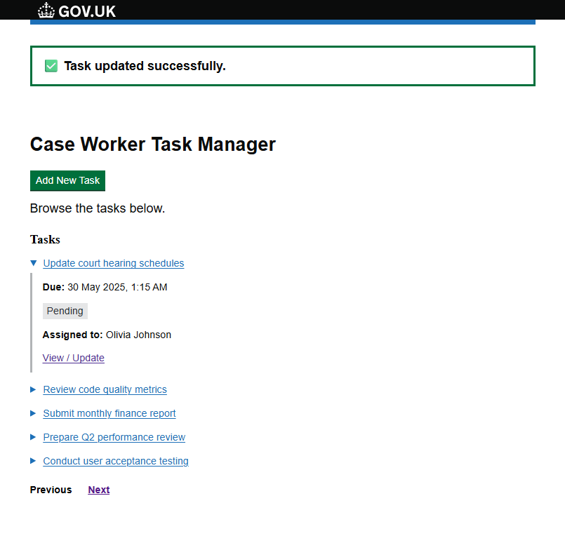
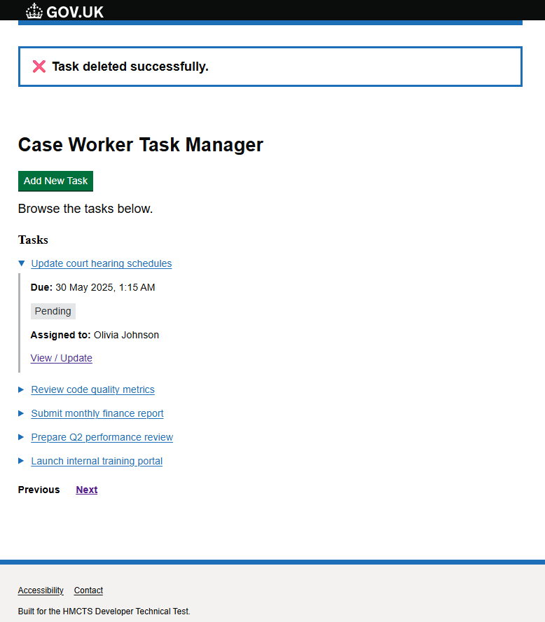
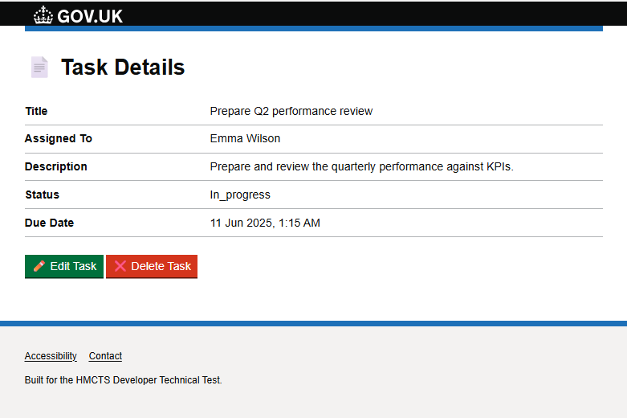

# DTS Task Manager

A Laravel-based task management system built for the HMCTS Developer Challenge.

## 🧱 Architecture Overview

This application uses a clean architecture pattern:
- **Controllers** handle routing and request entry points
- **Services** contain business logic (e.g., `TaskService`)
- **FormRequest** classes handle validation logic
- **Models** interact with the database
- **Factories** and **Feature tests** help with automated testing

Follows Laravel best practices and is fully commented for clarity.

---

## 🚀 Setup Instructions

1. **Clone the repository**

```bash
git clone https://github.com/lidichamp/dts-task-manager.git
cd dts-task-manager
```

2. **Install dependencies**

```bash
composer install
npm install && npm run dev
```

3. **Environment setup**

```bash
cp .env.example .env
php artisan key:generate
```

4. **Database setup**

Configure your database in `.env`, then run:

```bash
php artisan migrate --seed
```

5. **Run the application**

```bash
php artisan serve
```

---

## ✅ Running Tests

Ensure your `.env` is set for testing (e.g., use SQLite or a test DB):

```bash
php artisan test
```

Includes:
- Task creation
- Task updating
- Task listing


---

## 🏛️ GOV.UK Design System Integration

This application aligns with the [GOV.UK Design System](https://design-system.service.gov.uk/) to ensure accessibility, consistency, and usability for public services.

Key integrations include:

- ✅ **Notification banners** for success and error messages using `govuk-notification-banner`
- ✅ **Semantic HTML** and GOV.UK layout classes for accessible structure
- ✅ **Clear form validation** patterns aligned with GOV.UK guidelines
- ✅ **Consistent typography and spacing** using the GOV.UK Frontend toolkit

### 📦 GOV.UK Frontend Library (via NPM)

The app includes the official **GOV.UK Frontend** library using the `govuk-frontend` package via NPM, ensuring a scalable and maintainable development process.

```bash
npm install govuk-frontend
```

## 📸 Screenshots

A quick look at key features of the Task Manager app:

### 📋 Task List View
Displays all tasks with pagination, sorted by due date. 


### ➕ Create Task
Form for adding a new task with validation and user-friendly layout.


### 🖊️ Edit Task
Edit form pre-filled with task data for quick updates.


### ✅ Success Notification
GOV.UK-style success banner shown after successful task creation or update.


### 🗑️ Delete Notification
Banner alert shown when a task is deleted.


### 🔍 Task Details
Detailed view of a single task, including title, description, assignee, and due date.


---
## 📫 API Documentation

You can easily test the Task Manager API using the official Postman collection:

🔗 [Online Postman Collection (with sample requests)](https://api.postman.com/collections/3789962-48629e21-0acd-4879-a1d7-9e59c28fca04?access_key=PMAT-01JWAE5AJ4ZASS8BNHV3RN313K)


This collection includes:

✅ Example requests for creating, viewing, updating, and deleting tasks

✅ Sample payloads and expected responses

✅ Automatically configured endpoints and headers

Alternatively, if you prefer to import manually, an exported version is also included:

📄  

💡 Simply drag the JSON file into Postman or use the “Import” button to get started.


### Example Endpoints

- `GET /api/tasks` — List all tasks
- `POST /api/tasks` — Create a new task
- `GET /api/tasks/{id}` — View a task by ID
- `PUT /api/tasks/{id}/status` — Update a task status
- `DELETE /api/tasks/{id}` — Delete a task


## 🔐 Authentication (Laravel Sanctum)

This project uses [Laravel Sanctum](https://laravel.com/docs/sanctum) for secure API authentication.

---
## 🎯 Why Laravel?

- Enables rapid development with clear MVC structure
- Mature support for services, tests, and custom validation
- Demonstrates strong software engineering practices

---

## 🎓 What This Demonstrates

- Separation of concerns via service classes
- Clean, reusable validation logic
- Production-quality coding standards
- Full unit/feature testing
- Code that is easy to onboard, maintain, and scale

---


## 🛠️ Tech Stack

- **PHP 8+** with Laravel
- **MySQL** for data persistence
- **Blade & GOV.UK Frontend** for UI
- **Postman** for API testing
- **PHPUnit** for feature tests
- **Faker** for seeding test data
- **NPM** for frontend asset management


---
## 🛡️ Note

This repository contains no personal data and is fully anonymised to meet Civil Service blind hiring policy.
---
